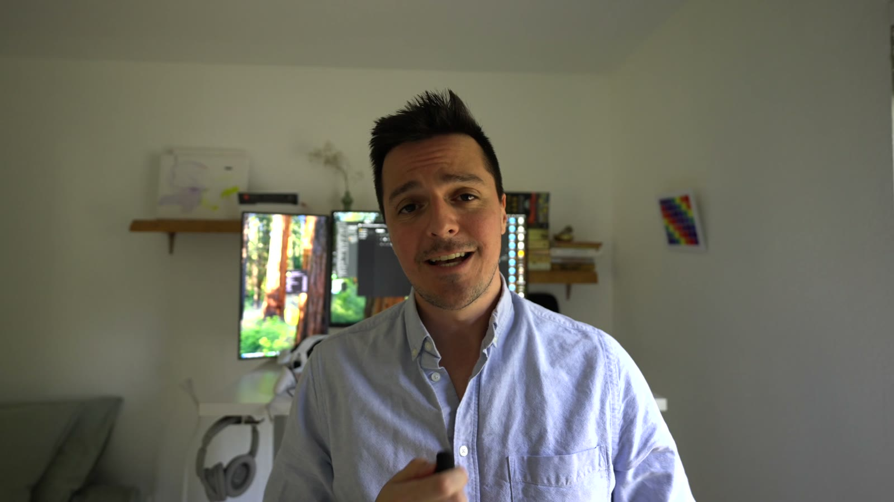

# Nerdy AI + VR — Math Workbench: Airlift

A mixed-reality math lounge for Meta Quest 3 and 3S, built in Unity in five days for the Nerdy AI Hackathon
(September 13 to 18, 2026). You arrive in a lounge in your own room. Dee, a live voice guide, shows you around.
Three hands-on lessons wait on the wall: fractions at a harbor dock, division in a café, multiplication in a
garden. The math is checked by deterministic code; the AI explains, never grades.

**Meta Quest 3 / 3S · Unity 6 · OpenXR + Meta XR SDK · OpenAI Realtime voice · MIT**

## Watch it

[](https://github.com/alediez2048/math-workbench-airlift/releases/download/v0.2-hackathon/nerdy-demo-full-walkthrough.mp4)

- **Full demo, 13 minutes, presented** (the pitch on camera, then every screen on the headset):
  [nerdy-demo-full-walkthrough.mp4](https://github.com/alediez2048/math-workbench-airlift/releases/download/v0.2-hackathon/nerdy-demo-full-walkthrough.mp4) · 1080p
- **Headset cut, 80 seconds**, no talking, straight from a Quest 3S recording:
  [nerdy-ai-vr-demo.mp4](https://github.com/alediez2048/math-workbench-airlift/releases/download/v0.2-hackathon/nerdy-ai-vr-demo.mp4)
- **Landing page:** [nerdy-vr-landing.vercel.app](https://nerdy-vr-landing.vercel.app)
- **Walkthrough with pictures:** [docs/WALKTHROUGH.md](docs/WALKTHROUGH.md)


## Contents

1. [The idea](#the-idea)
2. [What you do](#what-you-do)
3. [The three lessons](#the-three-lessons)
4. [Dee, the voice guide](#dee-the-voice-guide)
5. [Pedagogy rules the code enforces](#pedagogy-rules-the-code-enforces)
6. [Privacy and safety](#privacy-and-safety)
7. [Architecture](#architecture)
8. [Testing](#testing)
9. [Build and run](#build-and-run)
10. [How it was built in five days](#how-it-was-built-in-five-days)
11. [Known limits and what is next](#known-limits-and-what-is-next)
12. [Repository map](#repository-map)
13. [Credits and license](#credits-and-license)

## The idea

Fractions, division and multiplication are usually met as symbols on a page before a child has anything to
hold. In mixed reality the whole can sit on a table in your room: one container, two equal halves, four
quarters, and a ruler from 0 to 1 that they line up on. A guide who can see the same table can answer "why is
this a half?" the moment it is asked.

Three decisions shaped everything:

- **The math is deterministic.** A crate is one half because the code split it in two equal chunks, not because
  a model said so. The app checks every load, order and bed; the AI only reads the result out and helps.
- **The guide is live, grounded and bounded.** Dee is OpenAI's Realtime voice model with a server-authored
  persona and a fixed set of tools. She hears the learner, sees a short app-authored description of the table,
  and can only act through tools the app validates. Every tool has a button twin.
- **Wrong is repairable.** Wrong arrangements stay editable, feedback describes the table rather than the
  learner, and there are no timers, stars, streaks or scores.

## What you do

| | |
|---|---|
|  | **Arrive.** The board in front of you lights up with the logo, then *Meet Dee, your Nerdy AI + VR guide*. One press on *Let's begin*. Three chip questions (age band, interests, goal) or Skip. |
|  | **Take the tour.** Dee walks you through the lesson wall in six stops: filters, next page, previous page, the Nerdy lounge scenery, settings, and your first lesson. Everything she is not talking about dims until you press the highlighted control. |
|  | **Cargo Crew · Fractions.** You are the load planner at Dock 7. Split one container into halves and quarters with the splitter, load trucks, pickups and vans, and see 2/4 = 1/2 on the ruler under the beds. |
|  | **Neighborhood Café · Division.** Deal pastries onto plates a round at a time, pack orders into full boxes, and check the order when you think it is fair. |
|  | **Community Garden · Multiplication.** Plant seedling strips row by row, turn the bed to see 3 × 4 become 4 × 3, and split a bed with a fence. Accepted rows sprout. |
|  | **Make it yours.** Your room (passthrough) or the Nerdy lounge, English or Español, captions, volumes, Play/Stop for Dee, replay the tour, and an Age pill that gates the microphone. |

## The three lessons

Each lesson is a toy table that appears in your room, a story card above it, and five chapters. A yellow handle
on the front edge lets one hand carry the table and two hands resize it. The app checks only when asked, by
button or by voice, and accepted work has a payoff: vehicles drive away, plates slide to the guests, rows sprout.

### Cargo Crew · Fractions · Dock 7

Cranes unload full crates from the ship. You split crates into equal chunks so each vehicle gets its share of
one container. Vehicle beds sit side by side over a ruler from 0 to 1 that stands for one whole container, so
equal chunks line up and 2/4 lands exactly where 1/2 does.

| # | Chapter | The math |
|---|---|---|
| 1 | Big truck | One whole container, labeled 1 |
| 2 | Two pickups | 1/2 + 1/2 = 1 |
| 3 | Four vans | 1/4 + 1/4 + 1/4 + 1/4 = 1 |
| 4 | Same share, smaller boxes | 2/4 = 1/2 |
| 5 | Top it up | 1/2 + 1/4 + 1/4 = 1 |

Before the chapters, *Crew training* shows one crate moving from the tray to the loading pad and then has you
do it with the grip. Voice: "split it", "load it", "put everything back", "next chapter", "start this chapter
over", "show me the demo", "back to the lessons".

### Neighborhood Café · Division · Corner Café

Pastries come out of the oven, guests share them on plates, and orders go out in boxes. Sharing onto plates:
every pastry goes on a plate and every plate holds the same number. Packing into boxes: every box used is full,
and the number of boxes is the answer. Served plates slide to the guest table; full boxes leave on the bike.

| # | Chapter | The math |
|---|---|---|
| 1 | Two friends | 6 ÷ 2 = 3 |
| 2 | Table of three | 12 ÷ 3 = 4 |
| 3 | Box it up | 12 ÷ 4 = 3 |
| 4 | Bigger order | 15 ÷ 5 = 3 |
| 5 | Fact family | 12 muffins shared onto 4 plates and packed 3 to a box |

Voice: "deal a round", "check the order", "clear the table", plus the shared chapter commands.

### Community Garden · Multiplication · Sunny Plot

Seedlings come in strips, and each strip plants one whole row of a bed. Beds are always read as rows × columns.
A bed is accepted when every row is planted with the same number of seedlings. Accepted rows sprout into lettuce,
carrots, sunflowers and beans.

| # | Chapter | The math |
|---|---|---|
| 1 | First rows | 3 × 4 = 12 |
| 2 | Equal rows | 4 × 5 = 20 |
| 3 | Turn the bed | 3 × 4 = 4 × 3 = 12 |
| 4 | Split the bed | 7 × 6 = 7 × 5 + 7 × 1 = 42 |
| 5 | Your own split | You choose where the fence goes |

Voice: "turn the bed", "split it at five", "check the bed", "clear the bed", plus the shared chapter commands.

## Dee, the voice guide

**Session.** At launch the headset asks the guide proxy for a short-lived client secret, then opens a WebSocket
to OpenAI's Realtime API. The persona, the voice and the language (English or Español, locked at mint) are set
by the server; the app cannot change them. The proxy is a single Vercel function
([services/guide-proxy](services/guide-proxy)) that owns the provider key, rate-limits by build and nonce, and
never proxies audio.

**Grounding.** The app pushes one thing into the conversation: a short, app-authored description of what is on
the table right now, what the learner can grab, and what the current instruction says (never unsubmitted
correctness, never free text from the learner). Dee reads the verdicts the code produced; she does not judge.

**Tools.** Dee acts only through function calls that the app validates before anything moves. Every tool has a
button twin, so the app works with the microphone off.

| Area | Tools |
|---|---|
| Welcome | `record_profile`, `end_welcome` |
| Wall | `dashboard_open_tile` (lesson, chapter, or "continue"), `dashboard_filter`, `describe_card`, `open_settings`, `replay_rundown` |
| Any lesson | `advance_step`, `request_help`, `replay_demo`, `next_chapter`, `restart_chapter`, `back_to_lessons` |
| Cargo Crew | `split_cargo`, `check_load`, `reset_cargo` |
| Café | `cafe_deal_round`, `cafe_check_order`, `cafe_clear_table` |
| Garden | `garden_turn_bed`, `garden_split_bed(columns)`, `garden_check_bed`, `garden_clear_bed` |

**Policy.** The microphone is off on the welcome card and during the questions. It turns on for an adult once
the questions are done, or when the Age pill in settings is set to Adult. **Stop** on Dee's bar cuts speech,
closes the mic and drops any late response; **Play** resumes where she was. A notice beside the button says why
she is not listening (no age answer, adult testers only, voice guide off). Prompts queue behind the active
response so the API never sees two at once.

**Tour narration.** The six tour lines are spoken word for word on an isolated, response-correlated lane: the
transcript is checked against the script before playback, so a stale or improvised line can never replace the
instruction on screen.

**Offline.** No Wi-Fi or no proxy means Dee is offline: captions still update from the app, and every control is
a button.

## Pedagogy rules the code enforces

- Mathematical correctness is deterministic C#, never a model judgment.
- Every fraction, quotient and product refers to a visible equal whole on the table.
- Equivalent fractions share the same length and the same endpoint on the ruler.
- Notation and manipulatives stay synchronized: 6/8 is authored as 6/8 and shown as 6/8, not reduced behind
  the learner's back.
- Neutral slots allow mathematically wrong arrangements; the app evaluates only on check.
- Feedback describes the task or the table and leaves mistakes repairable.
- No timers, lives, streaks, stars, generic praise or punitive loss.
- The app logs observable events only; it never infers counting or gaze from controller motion.

## Privacy and safety

This is an adult-tester preview, enforced in the build. Child use is a separate review
([docs/00-build/PRIVACY-GATE.md](docs/00-build/PRIVACY-GATE.md)).

| Data | Where it goes | Kept |
|---|---|---|
| Microphone audio (24 kHz PCM) | OpenAI Realtime over TLS, only while a session is live and the mic is on | Not by us |
| Dee's audio and transcripts | OpenAI to the headset; captions rendered live | Not written to disk |
| Profile tags (age band, up to five interests, goal) | On the headset only, enum-validated | On device, erasable in settings |
| App context (instruction, table facts, verdicts already shown) | OpenAI, as short system messages | Not by us |
| Launch nonce and build id | The proxy, for rate limiting | Logged without the nonce |

No accounts, no names, no images, no persistent device identifiers, no free text. The provider key lives only
in the proxy's environment; it is not in the APK, the repo or any document.

## Architecture

```
Quest 3S ── Unity app (com.nerdy.vr.lounge) ── WSS ──▶ OpenAI Realtime
                 │                                        ▲
                 └── HTTPS /session ──▶ Vercel guide-proxy ┘ (mints the client secret; owns the key)
```

**Unity project, `unity/Assets/Airlift/Scripts`** (87 C# files, about 10,800 lines; C# 9, Unity 6000.6, URP):

| Folder | Holds |
|---|---|
| `Welcome/` | `NerdyDirector`, the orchestrator: consent → questions → wall → lesson, and every guide tool. `WelcomeFlow` is the pure state machine; `GuidePolicy` and `GuideSteps` are the pure rules (mic, notices, Back/Next, what the guide may say). |
| `Lounge/` | The room (`LoungeRoom`, scenery, arrival), the host tour (`RundownScript` is the pure six-stop script, `LoungeRundown` the scene overlay), settings (`SettingsPanel`, `LoungeSettings`), the on-disk stores, the B-button watcher. |
| `Guide/` | `GuideSession` (mint → connect → stream mic → play audio → tools), `MicStreamer`, `AudioPlayback`, `PromptGate`, `ScriptedNarration`, `GuideContextBuilder`, `GuideMessages`. |
| `Catalog/` | `LessonCatalog` (the three lessons, their facts for Dee), `DashboardCatalog` (24 tiles, filters, Continue). |
| `Lessons/` | The `LessonStation` platform every lesson sits on, `LessonToolRouter` (pure routing of tool calls), and the three lessons: Cargo (`CargoLessonDirector`, `CargoLessonModel`, `CargoChapter`, `SplitterRules`, `RulerLayout`), `Cafe/` and `Garden/` (model, chapter, station each). |
| `Math/` | `FractionValue` (exact, reduced quantity) and `FractionNotation` (authored, not reduced). |
| `Presentation/` | The design system in code: `NerdyStyle` (colours, type, sprites) and `NerdySpace` (sizes and distances), the dashboard wall, press logging. |
| `Onboarding/` | The original Cargo briefing, demonstration and grab practice. |

**Scenes are built by scripts.** Everything in `CargoCrew.unity` beyond the XR rig is created by idempotent
editor scripts under `unity/AgentScripts` (about sixty of them: `BuildLounge`, `BuildDashboard`, `BuildTour`,
`BuildSettingsPanel`, `AddAgeRow`, the three workbench builders, and preview renderers that screenshot the
board from the player's head for review). Rebuilding a surface is a script run, not hand editing, which is what
let several agents work on one scene.

**Design system.** Nerdy's palette (indigo #202344 base, #161C2C surfaces, #6C6E87 lines, lavender #9E97FF,
amber #FFC32B, magenta #FB43DA, orchid #D684FF, cyan #17E2EA), Poppins and Karla, capsule pills and rounded
cards, all as `NerdyStyle` tokens; spatial standards (board distance, pill height, tile size) as `NerdySpace`
constants; tests assert both.

## Testing

**Unity EditMode:** 59 suites, 525 checks, about 10,000 lines of tests under `unity/Assets/Airlift/Tests`,
in four kinds:

- **Pure rules**: fraction arithmetic and notation, chapter models for all three lessons, splitter rules, the
  tour script, the welcome state machine, guide policy, tool routing, privacy gate, prompt gate.
- **Scene wiring**: opens `CargoCrew.unity` and asserts what the builders produced: the wall has 24 tiles and
  the bar is the last sibling, the tour ring sits on the right control at each stop, the Age pill calls the
  right method, every caption fits its card, the board sits at the spatial standard.
- **Characterization**: `CargoVoiceCharacterizationTests` replays a scripted Cargo session and diffs every
  message the app would send to the voice API against a golden recording, so a change to what Dee is told is
  a visible diff.
- **Style and identity**: fonts, tokens, capsule pills, app name and package.

Headset scripts, one per surface, with the evidence from each owner run: [docs/qa](docs/qa).

```bash
export UNITY_PROJECT_PATH=$PWD/unity     # the Unity Pipeline CLI, with the editor open
unity command run_tests editor GuidePolicyTests testName false true 300
```

## Build and run

You need Unity 6000.6.0f1 with the Android modules, a Quest 3 or 3S in developer mode, and `adb`.

```bash
git clone git@github.com:alediez2048/math-workbench-airlift.git
cd math-workbench-airlift
# open unity/ in Unity 6000.6.0f1 once so it imports (about 10 minutes the first time)

# preview build: builds, installs beside any release build, and launches on the headset
bash scripts/lounge-preview.sh

# start as a brand-new learner
adb shell pm clear com.nerdy.vr.lounge
adb shell monkey -p com.nerdy.vr.lounge -c android.intent.category.LAUNCHER 1
```

Voice needs Wi-Fi on the headset and a deployed guide proxy; see
[services/guide-proxy/README.md](services/guide-proxy/README.md). Without it Dee is offline and the app runs
on buttons and captions. Presses and tool calls are logged (`adb logcat -s Unity:I`, lines tagged `[Nerdy]`
and `[Guide]`), which is how every headset report in the dev log was diagnosed.

## How it was built in five days

One person, a Quest 3S, Claude Code and Codex, and a rule: nothing counts until the owner accepts it on the
headset. The [dev log](docs/00-build/DEV-LOG.md) has every step; the short version:

| Day | What landed |
|---|---|
| Sep 13 | Plan vetted; Unity 6, OpenXR and the Meta SDK chosen; the device-proof scene |
| Sep 14 | Passthrough, controllers and grabbing confirmed on the Quest; onboarding scene (briefing, demo, practice) |
| Sep 15 | Cargo environment, typography and the baseline APK; a disappearing station traced to the gravity locomotor |
| Sep 16 | Grabbing fixed, whole and halves accepted, the toy look, the carry handle; the Nerdy welcome with two-way voice; Dock 7 accepted with five chapters and cranes |
| Sep 17 | Café and Garden built by a six-agent team against written contracts on a shared lesson platform; the voice proxy deployed; concept intros and the splitter |
| Sep 18 | The lounge, the wall, the host tour, settings; an onboarding repair after the first headset review; the afternoon's fixes; docs, video and the landing page |

Working method: every surface is mocked on a design canvas and approved before it goes to the headset; builders
render the board from the player's head so a change can be seen before a build; agents working in parallel get
disjoint files and written C# contracts, and only one session runs Unity. Locked code (Cargo Crew) has a
characterization test so nobody can change what Dee is told without a diff.

## Known limits and what is next

- The voice golden test is red since the welcome copy changed on the last day; the recording has not been
  re-baselined.
- No performance capture has been recorded yet (the release gate asks for 72 Hz frame times in each scenery).
- Dee speaks Spanish; the cards and captions are English.
- Six more worlds are named on the wall as coming soon (Route 9, Ten & Trade, Corner Store, Platform Clock,
  The Tailor's Bench, Mile Marker) and do not open.
- Hands-only input, scene understanding and automatic placement were deliberately left out; controllers are
  required.
- Child-facing release needs the privacy review above; learning outcomes have not been evaluated.

## Repository map

| Path | What is there |
|---|---|
| [unity/](unity) | The Unity project: scripts, scene builders (`AgentScripts`), tests, fonts and the design tokens |
| [services/guide-proxy/](services/guide-proxy) | The Vercel function that mints Realtime sessions and holds Dee's persona and tools |
| [site/](site) | The landing page, deployed to Vercel from this folder |
| [docs/README.md](docs/README.md) | The documentation map |
| [docs/WALKTHROUGH.md](docs/WALKTHROUGH.md) | The experience step by step, with pictures and voice commands |
| [docs/00-build/](docs/00-build) | Dev log, plans, contracts, tickets, style guide, privacy gate, release gates |
| [docs/qa/](docs/qa) | Headset test scripts and evidence |
| [docs/plans/](docs/plans), [docs/superpowers/specs/](docs/superpowers/specs) | Approved plans and design specs |
| [docs/media/](docs/media) | Headset stills and the demo GIF |
| [docs/history/](docs/history) | The first days' planning documents, unchanged |
| [CLAUDE.md](CLAUDE.md), [AGENTS.md](AGENTS.md) | Working instructions and current state for the coding agents |
| [scripts/](scripts) | `lounge-preview.sh` (build, install, launch) and the verification wrapper |

## Credits and license

Built by Alejandro Diez with Claude Code and Codex for the Nerdy AI Hackathon. Not an official Nerdy or Meta
product. Fonts Poppins and Karla under the SIL Open Font License (`unity/Assets/Airlift/Fonts`). Code and
documents under the [MIT License](LICENSE).
