# Walkthrough

What a first run looks like on a Quest 3S, in the order you meet it. Pictures are frames from a headset
recording on September 18, 2026 (passthrough, adult tester). The full demo is the
[80-second video](https://github.com/alediez2048/math-workbench-airlift/releases/download/v0.2-hackathon/nerdy-ai-vr-demo.mp4).

## 1. Arrive

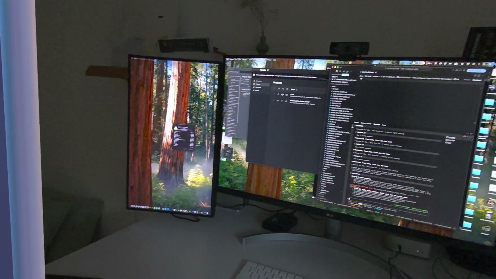

Put the headset on and launch **Nerdy Lounge (preview)**. A whiteboard stands in your room. Dots fly in and
assemble into the Nerdy AI+VR logo while Dee connects; a slim progress bar shows only while something is
still loading.

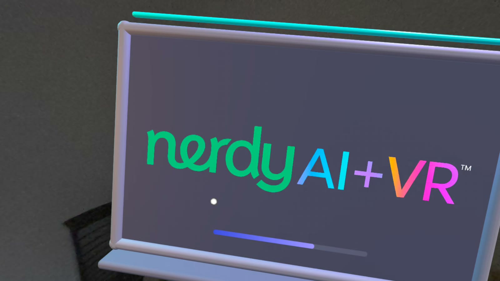

## 2. Meet Dee

Dee greets you by voice as soon as she is connected. The board shows *Meet Dee, your Nerdy AI + VR guide*
and one button, **Let's begin**. Pressing it asks Android for the microphone once; the mic itself stays off
until you have answered the age question.

## 3. Three questions

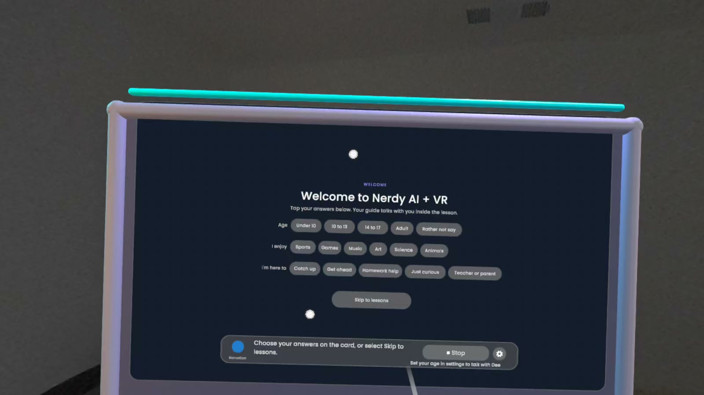

Age band, interests, goal, as chips. Dee records each answer. **Skip** goes straight to the wall, but with no
age answer Dee cannot listen, and she says so. Answering *adult* turns the microphone on as soon as the wall
appears.

## 4. The tour, six stops

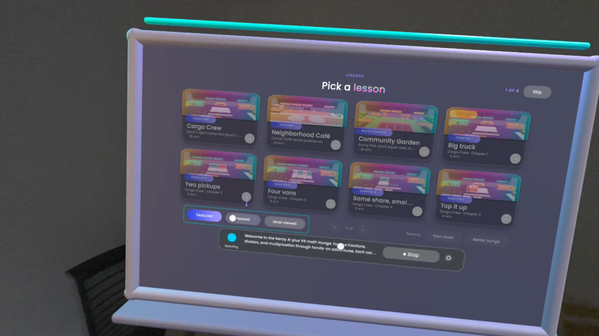

Dee shows you around the wall. Everything she is not talking about dims, and each stop waits for you to press
the highlighted control. Skip is always top right.

1. **Filters.** Featured, Newest, Most viewed sort the lessons. Press one.
2. **Next page.** The right arrow under the wall.
3. **Previous page.** The left arrow.
4. **Scenery.** *Your room* keeps passthrough; *Nerdy lounge* puts you in a virtual room. Lessons always run in your room.
5. **Settings.** Open the gear, look around, press Done.
6. **Pick a lesson.** The wall returns to Featured and the ring sits on Cargo Crew. Press any playable tile, or say "Dee, open Cargo Crew".

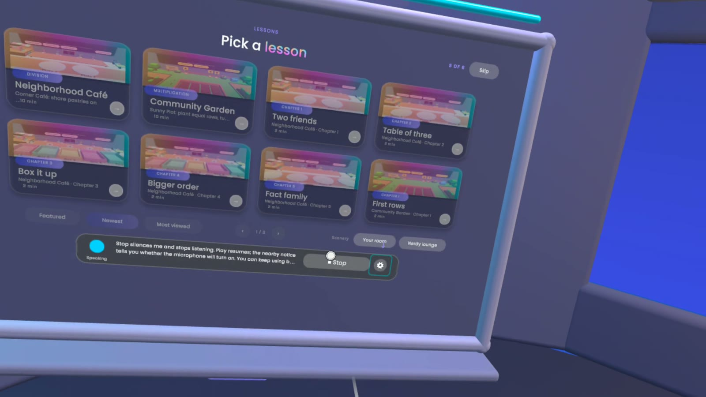

## 5. The wall

Eight tiles a page, three pages: the three lessons first, then their chapters, then six coming-soon worlds
that do not press. A chapter you opened wears a **Continue** ribbon. B on the right controller is Back.

## 6. A lesson: Cargo Crew

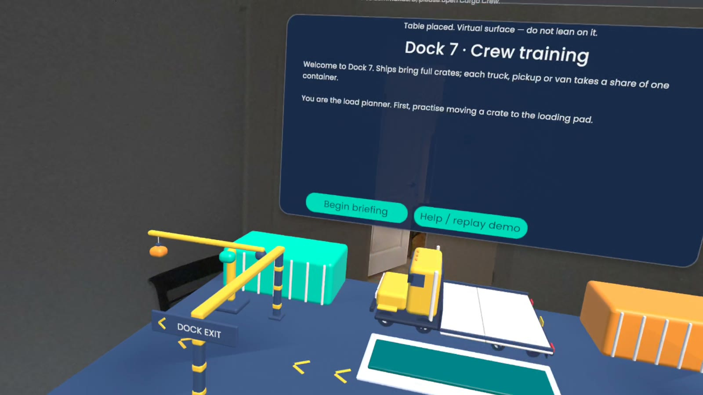

Dock 7 replaces the wall in your room. Dee welcomes you as your dock partner and the crew-training card
walks you through one crate: watch the demo, then move a crate to the pad yourself with the grip.

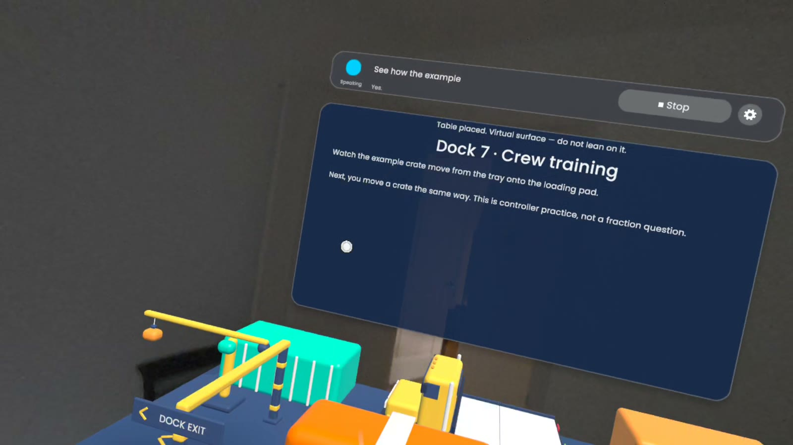

Then the chapters. **Big truck** loads one whole container. **Two pickups** needs halves: press the splitter
or say "split it", and each pickup takes 1/2.

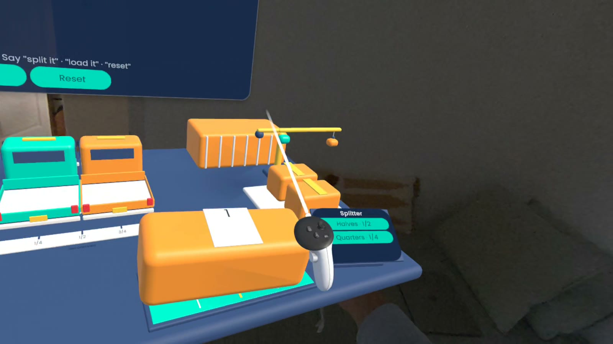

**Four vans** needs quarters, and the ruler under the beds shows where 1/4, 1/2 and 3/4 fall.

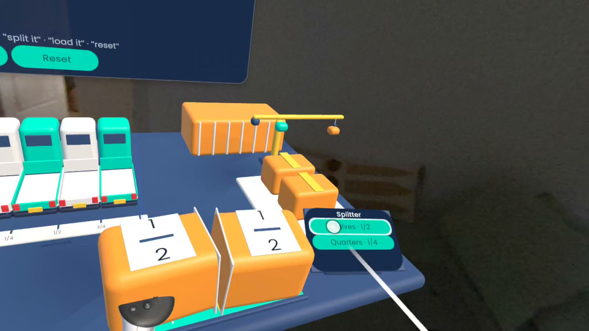

Say "load it" or press Check load; the app checks the quantities and Dee reads the result out. Wrong loads
stay editable. **Exit lesson** (the X top right, or B) brings you back to the wall.

## 7. Neighborhood Café and Community Garden

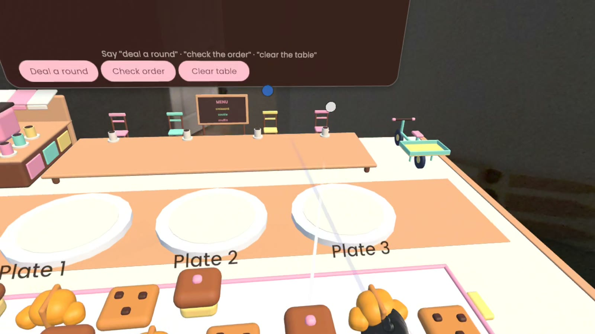

In the café you deal pastries a round at a time and check the order when every plate holds the same number.
In the garden each seedling strip plants one whole row; check the bed when the rows are equal, turn it to
see 3 × 4 become 4 × 3, and split it with a fence.

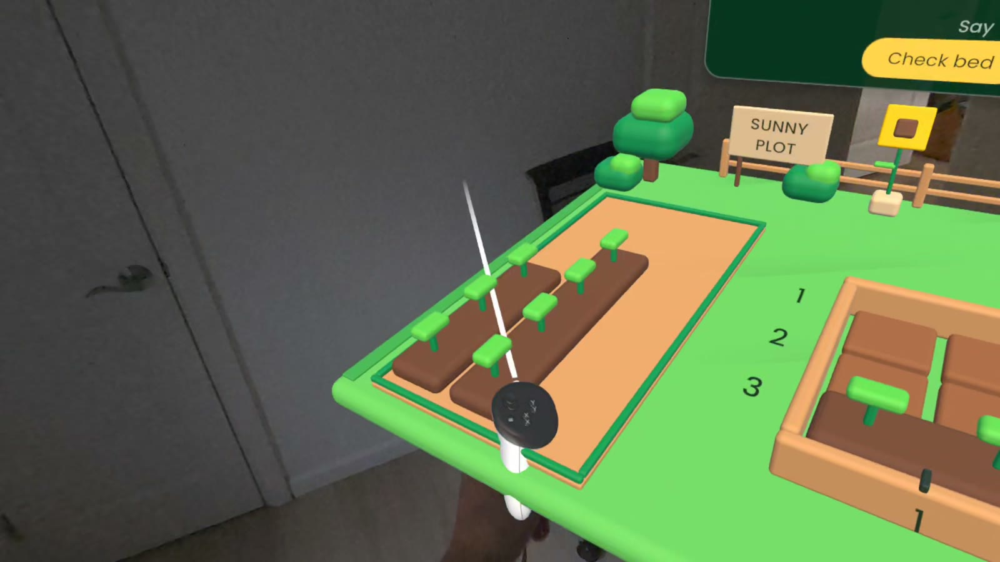

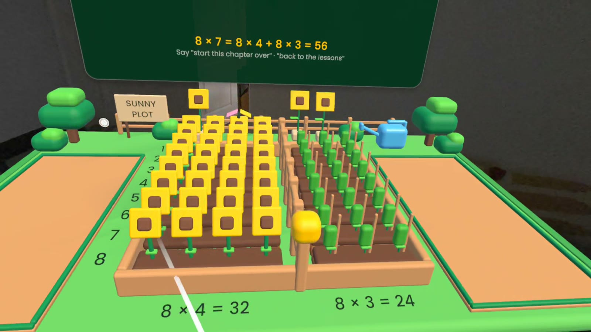

## 8. Settings

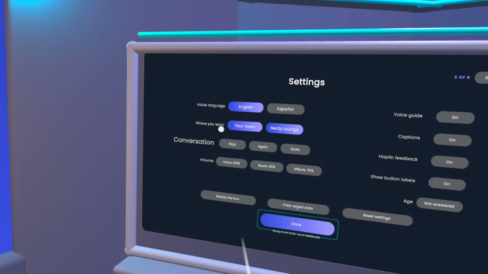

The gear on Dee's bar opens the card on the wall or inside a lesson. Voice language (English, Español;
Dee reconnects in the new language and carries on), Where you learn, the Conversation row (Stop, Again,
Mute), three volumes, four switches (Voice guide, Captions, Haptic feedback, Show button labels), the
**Age** pill, Replay the tour, Clear saved data (two presses), Reset settings, Done.

## 9. Back on the wall

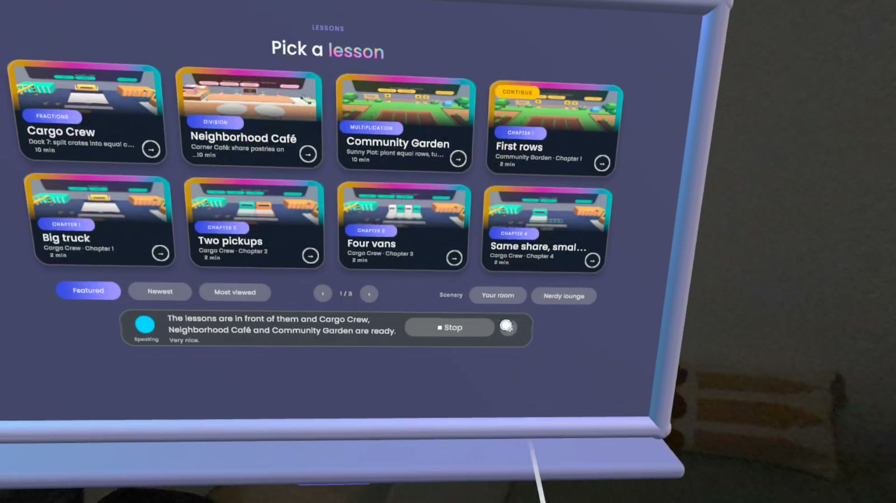

Dee says welcome back; the chapter you left wears the Continue ribbon. Quit and relaunch and you skip the
questions and the tour.

## Dee's voice commands

Dee's bar shows **Stop** while she is active and **Play** when stopped; the notice beside it says whether Play
will turn the microphone on. Each command below is a tool the app validates before acting, and each has a
button twin.

| Where | Say | What happens |
|---|---|---|
| Wall | "Dee, open Cargo Crew" · "open chapter 2 of the café" · "continue" | Opens the lesson or chapter |
| Wall | "show me the newest" · "what do I open most" · "featured" | Sorts the wall |
| Anywhere | "open settings" · "change the language" | Opens the settings card |
| Anywhere | "how does this work again" · "replay the tour" | Replays the tour from the wall |
| Any lesson | "yes" · "start" · "next step" · "continue" | Advances the briefing or practice |
| Any lesson | "show me the demo again" · "show me how" | Replays the demonstration |
| Any lesson | "help" · "what do I do" | Reads the approved hint for the step |
| Any lesson | "next chapter" · "start this chapter over" · "back to the lessons" | Chapter navigation and exit |
| Cargo Crew | "split it" · "cut it in half" · "load it" · "check my load" · "put everything back" | Split, check the load, reset |
| Café | "deal a round" · "one each" · "check the order" · "clear the table" | Deal, check, reset |
| Garden | "turn the bed" · "split it at five" · "check the bed" · "clear the bed" | Turn, fence, check, reset |

Buttons always work: Play/Stop, the gear, the tile and filter pills, and every card's own controls.
